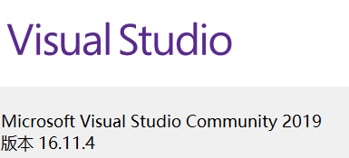

# 项目说明

> 经测试，项目文件删除`.vs`后可能导致无法运行问题，故仅删除`Debug`文件
> 

*目录*

# 0 环境相关

## 0.1 VS 2019

## 0.2 GLUT库配置

下载资源包，将文件依次放入对应路径：

`glut.dll` `glut32.dll`
C:\Windows\SysWOW64
（C:\Windows\System32）

`glut.h`
C:\Program Files (x86)\Microsoft Visual Studio\2019\Community\VC\Tools\MSVC\14.29.30133\include

`glut32.lib` `glut.lib` 
C:\Program Files (x86)\Microsoft Visual Studio\2019\Community\VC\Tools\MSVC\14.29.30133\lib\x64
（C:\Program Files (x86)\Microsoft Visual Studio\2019\Community\VC\Tools\MSVC\14.29.30133\lib\x86）

> 配置参考：[https://blog.csdn.net/weixin_42507994/article/details/121467599](https://blog.csdn.net/weixin_42507994/article/details/121467599)
> 

# 1 绘制Bezier曲线

运行项目，

鼠标左键单击界面空白出画点生成直线与曲线

（可交互）

# 2 绘制B样条曲线

运行项目，

鼠标右键单击界面空白出画点生成直线与曲线

（可交互）

# 3 绘制NURBS曲面

运行项目，

曲面自行绘制完毕

（不可交互）

# 4 拉伸生成实体

运行项目，

先行输入拉伸长度

点击最左按钮后，在界面空白处单击鼠标左键绘制多边形顶点

绘制完毕点击中间按钮生成多边形

点击最右按钮生成实体

键盘交互说明

> 键盘交互时需调整至英文输入
> 

# 5 旋转生成实体

运行项目，

先行输入转轴

点击最左按钮后，在界面空白处单击鼠标左键绘制多边形顶点

绘制完毕点击中间按钮生成多边形

点击最右按钮生成实体

键盘交互说明

> 键盘交互时需调整至英文输入
> 

# 6 问题&改进

1. 扩展鼠标交互功能
2. 添加其他实体样式
3. 增加实体的导入&导出功能
4. 优化图形界面，增加用户参数组件